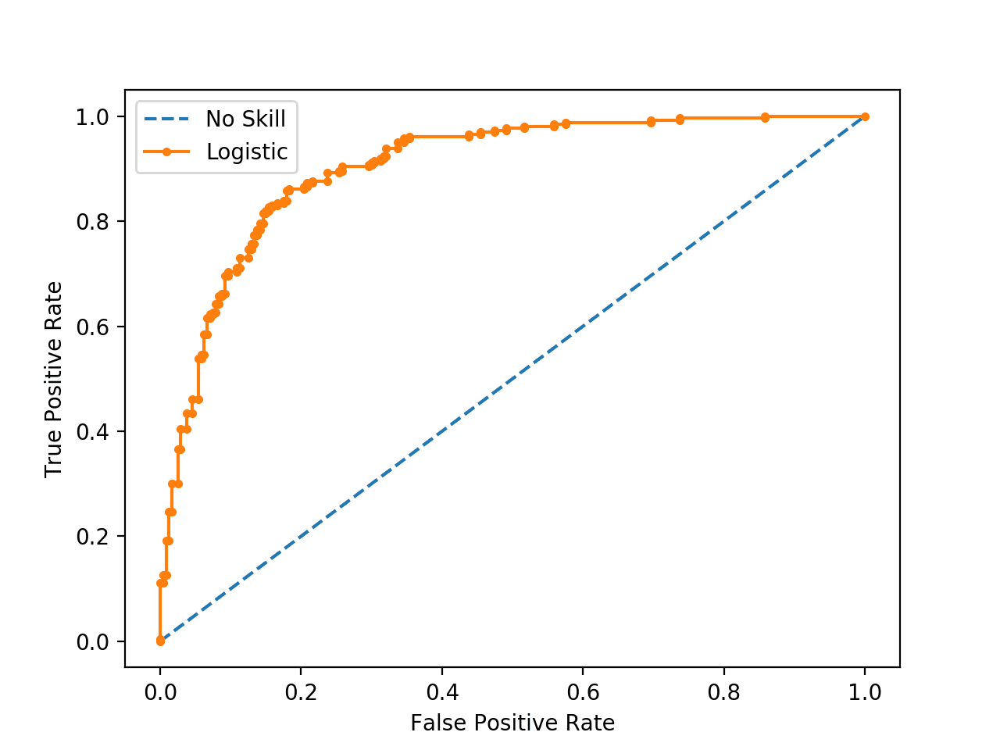
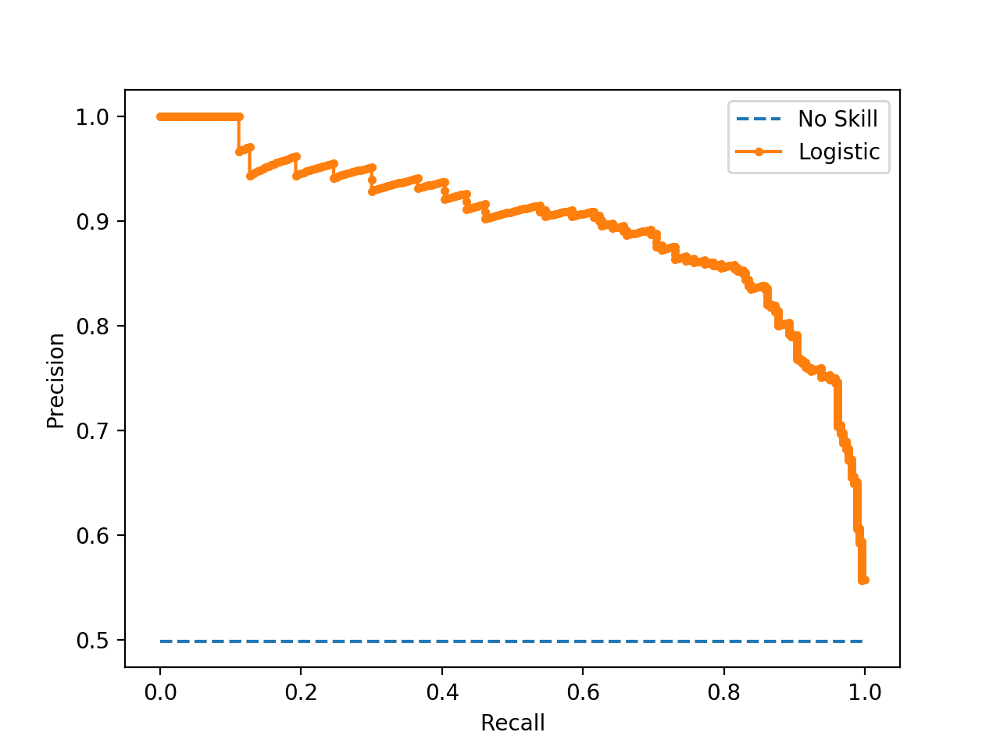
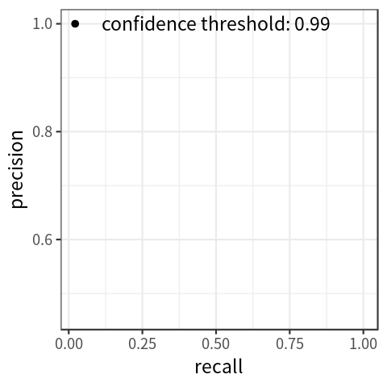
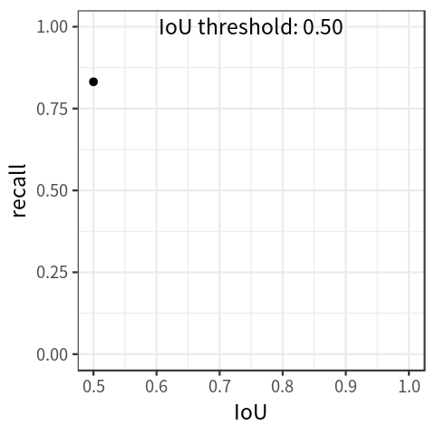
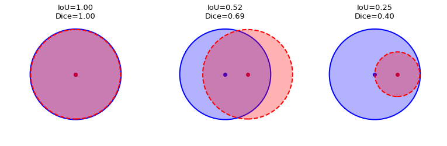

# Metrics
This section contains short summaries for various metrics, divided by tasks.

## Classification Metrics

### Accuracy

Measures a fraction of correctly classified objects w.r.t all objects: $\frac{1}{N}\sum_{i=1}^{N}[a(x_i) == y_i]$. Can be also expressed in the terms of *True Positive/False Positive/True Negative/False Negative*: $Accuracy = \frac{TP+TN}{TP+FP+TN+FN}$

### Precision

Measures how accurately our algorithm was labeling object with as positive: $\frac{TP}{TP+FP}$

### Recall

Measures how many *True Positive* objects our algorithm was able to *extract*, i.e. label as positive: $\frac{TP}{TP+FN}$

### F-score

A harmonic mean of Precision and Recall. In general form can be expressed in the following manner: $F_{\beta} = (1+\beta^2)\frac{precision \cdot recall}{(\beta^2 \cdot precision) + recall}$. Usually by F1-score is used: $F=\frac{2 \cdot precision \cdot recall}{precision + recall}$.

### AUC-ROC

An area under a line plotted in axis *True Positive Rate*-*False Positive Rate*, where $TPR = \frac{TP}{TP+FN}$ (basically, Recall) and $FPR = \frac{FP}{FP+TN}$. Each point of the line is calculated by varying a threshold for predictions.

AUC-ROC for random classifier and logistic regression. The source: [machinelearningmastery.com](https://machinelearningmastery.com/roc-curves-and-precision-recall-curves-for-imbalanced-classification/).

### AUC-PR

Same as AUC-ROC, but plotted in axis *Precision-Recall*

AUC-PR for random classifier and logistic regression. The source: [machinelearningmastery.com](https://machinelearningmastery.com/roc-curves-and-precision-recall-curves-for-imbalanced-classification/).

## Regression Metrics

### Mean Absolute Error

$MAE(a, X) = \frac{1}{N} \sum_{i=1}^{N}|a(x_i) - y_i|$

### Mean Squared Error

$MSE(a, X) = \frac{1}{N} \sum_{i=1}^{N}(a(x_i) - y_i)^2$. To preserve an original measurement unit, can be transformed into *RMSE*: $RMSE(a, X) = \sqrt{\frac{1}{N} \sum_{i=1}^{N}(a(x_i) - y_i)^2}$

### R2-score

Sometimes referred as **Coefficient of Determination**. Measures explained variance by the model. Mathematically, it is a normalized *MSE*: $R^2(a,X) = 1 - \frac{\sum_{i=1}^{N}(a(x_i) - y_i)^2}{\sum_{i=1}^{N}(y_i - \bar{y})^2}$, where $\bar{y} = \sum_{i=1}^{N}y_i$ - mean value of all labels.

### Pearson Correlation Coefficient

Measures a linear dependency between two given variables: $r_p = \frac{\sum_{i=1}^{N}(x_i - \bar{x})(y_i - \bar{y})}{\sqrt{\sum_{i=1}^{N}(x_i - \bar{x})^2\sum_{i=1}^{N}(y_i - \bar{y})^2}}$, where $x_i$ and $y_i$ are two observation of corresponding variables.

**Important** - PCC can display high degree of correlation even for highly non-linear dependencies, thus it should not be used to judge whether the dependency itself is linear or not.

### Spearman Correlation Coefficient

Measures the monotonicity between two given variables (can be applied to non-linear dependencies). It is defined as PCC between *ranks* of observations: 
$r_s = \frac{\sum_{i=1}^{N}(R(x_i) - \bar{R_x})(R(y_i) - \bar{R_y})}{\sqrt{\sum_{i=1}^{N}(R(x_i) - \bar{R_x})^2\sum_{i=1}^{N}(R(y_i) - \bar{R_y})^2}}$, where $\bar{R_x}$ and $\bar{R_y}$ are mean ranks for corresponding variables. If all ranks are distinct integers, can be computed with this formula: $r_s = 1 - \frac{6\sum_{i=1}^{N}d_i^2}{N(N^2-1)}$, where $d_i = R(x_i) - R(y_i)$.

## Object Detection Specific Metrics

### Mean Average Precision

Evaluates how *precise* are the detections, i.e. how well a detector distinguishes classes against others. For simplicity, original AP curve is interpolated following this rule: $precision_{interp}(recall) = \max_{recall' \ge recall} precision(recall')$.

Basically, it is AUC-PR, but each curve for Average Precision is plotted for given IoU threshold. Average Precision is calculated using this formula: $AP = \sum_{i=1}^{n-1}(recall_{i+1} - recall_i) \cdot precision_{interp}(recall_{i+1})$. To get Mean Average Precision, average over all classes: $mAP = \frac{\sum_{i=1}^{K}AP_i}{K}$, where $K$ is the number of classes.

Precision-Recall curve for Average Precision. Source: [blog.zenggyu.com](https://blog.zenggyu.com/posts/en/2018-12-16-an-introduction-to-evaluation-metrics-for-object-detection/index.html)

### Mean Average Recall

Evaluates how *effective* the detector is at finding object of given class. Average Recall is AUC plotted in Recall-IoU axis. Usually, Average Recall is computed for $[0.5; 1]$ IoU range with this formula: $AR = 2 * \int_{0.5}^{1} recall(o)do$, where $o$ is IoU. To get Mean Average Recall, average over all classes: $mAR = \frac{\sum_{i=1}^{K}AR_i}{K}$

Recall-IoU curve for Average Recall. Source: [blog.zenggyu.com](https://blog.zenggyu.com/posts/en/2018-12-16-an-introduction-to-evaluation-metrics-for-object-detection/index.html)

## Segmentation Specific Metrics

### Pixel Accuracy

Computed in the same manner as regular *Accuracy*, but each object is a pixel of an output mask.

### Intersection-Over-Union (Jaccard Index)

Shows how well predicted masks align with ground truth masks. Given the same predictions, *Jaccard Index* penalizes harder for incorrect predictions than *Sørensen–Dice Coefficient*. Can be calculated using one of the two equivalent formulas: $IoU(Pred, GT) = \frac{\lVert Pred \cap GT  \rVert}{\lVert Pred \cup GT \rVert}$ or $IoU = \frac{TP}{TP+FP+FN}$

### Sørensen–Dice Coefficient (F1-score)

Can be calculated using one of the two equivalent formulas: $Dice(Pred, GT) = \frac{2\lVert Pred \cap GT  \rVert}{\lVert Pred \rVert + \lVert GT \rVert}$ or $IoU = \frac{2TP}{2TP+FP+FN}$

Examples of *Jaccard Index* and *Dice Coefficient* for different cases. Source: [ilmonteux.github.io](https://ilmonteux.github.io/2019/05/10/segmentation-metrics.html)